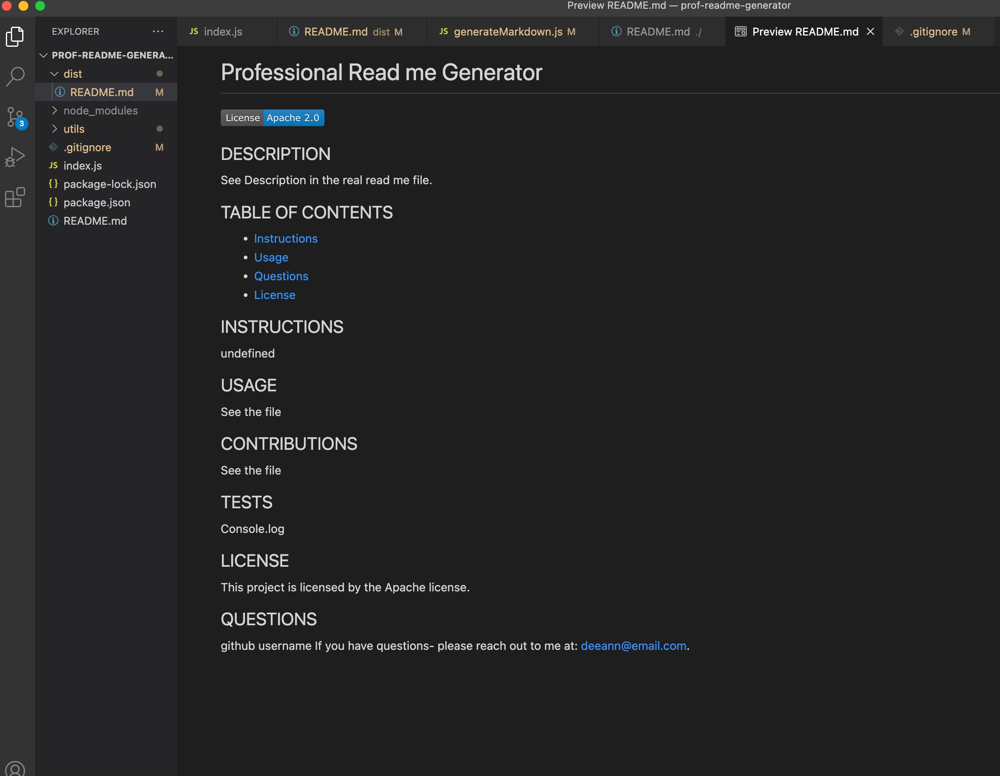

# Professional README Generator

## Table of Contents
- [Description](#description)
- [Visuals](#visuals)
- [Usage](#usage)
- [Contributions](#contributions)

## Description
This CLI app prompts the user to answer all of the questions needed for a professional README file. 
Once the questions are answered, the README is generated in the folder called "dist".

## Visuals

## Usage
The program runs when node index.js is input into the terminal. A series of questions prompt the user 
for responses which are then displayed in the dynamically created README file.

## Contributions
created by Deborah DeeAnn Stelzl
